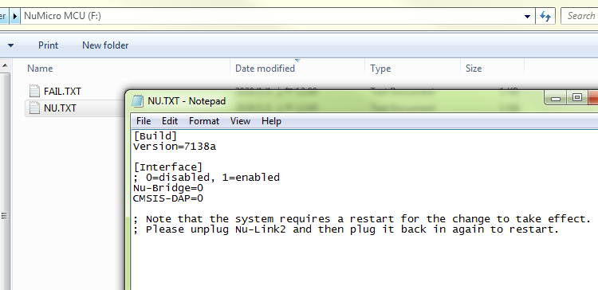
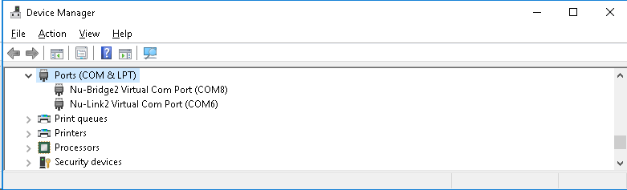

# Nu-Link3 debugging and programming adapter
When using the software development tools above, you may need a USB adapter. 
Here, we introduce a new feature-rich Nu-Link3 adapter to you. 
- [Where to buy](https://direct.nuvoton.com/tw/Nu-Link3)   
- [Nu-Link3 Debugger and Programmer User Manual](https://www.nuvoton.com/resource-download.jsp?tp_GUID=UG1320200319174043)  
On this page, we will only focus on the feature-rich Nu-Link3. If you wish to learn about other types of Nu-Link, please click the [link](https://www.nuvoton.com/tool-and-software/debugger-and-programmer/1-to-1-debugger-and-programmer/).   

An overview picture of software tools, adapters and targets  

### The firmware of the Nu-Link3 adapter
#### All Nu-Link3 firmware binary files can be found [here](./Latest_NuLink_Firmware)  
Users can reprogram Nu-Link3 with another .bin file using the following instructions (Windows OS)  
1. Press the button on Nu-Link3 and plug in the USB cable.
2. The "Nu-Link3" disk will appear.  (If you see the disk name as "NuMicro MCU", it will upgrade target the device firmware instead of Nu-Link3 itself) 
3. Drag and drop the Nu-Link3 firmware .bin file into the disk.
4. Re-plug the USB cable and it's done.  

#### More options for NuLink3FW (configuration file NU_CFG.TXT)   
#### Note: In NuLink3, you won't see the BRIDGE MODE option from NuLink2, because with sufficient endpoints, all USB interfaces exist simultaneously.
1. You will see some options in NU_CFG.TXT.
* Open the NU_CFG.TXT file in the pop-up "NuMicro MCU" disk  
<kbd></kbd>

2. For the Nu-Link3, you will see POWER-MODE option. You need to re-plug in the USB cable to activate the setting.
* Set POWER-MODE for SWD output voltage level (mainly for CMSIS-DAP interface use)
    
* It has a WebUSB interface conforming to the CMSIS-DAP protocol, and you can connect to KEIL Studio Desktop/Cloud via this interface.  
<kbd></kbd>

* The pass-through bridge function of Nu-Link3 will be enabled (The word Nu-Link2-Bridge will be used to represent the pass-through bridge application on Nu-Link3 adapter). Nu-Link2-Bridge pass-through the data between the VCOM port and I2C/SPI/RS485/CAN interfaces.
    (You will see a "Nu-Link2-Bridge Virtual Com Port" in device manager.)
<kbd></kbd>

* A USB HID interface that supports ISPTool will be enabled. This USB HID interface doesn't pass through data, it communicates with ISPTool via HID_ISP and offers I2C/SPI/RS485/CAN interfaces for ISPTool.

* A USB HID interface that supports Boot_Loader_ISPTool will be enabled. This USB HID interface doesn't pass through data, it communicates with Boot_Loader_ISPTool via HID_MKROM_ISP, and offers I2C/SPI/RS485/CAN interfaces for Boot_Loader_ISPTool.  
Only the NuMicro chip that supports mask ROM Boot Loader (e.g., M460 series) can commnuicate with [Boot_Loader_ISPTool](https://www.nuvoton.com/resource-download.jsp?tp_GUID=SW132022071806572776&currentFolder=/products/microcontrollers/arm-cortex-m4-mcus/m467-ethernet-crypto-series/)  

 
 
