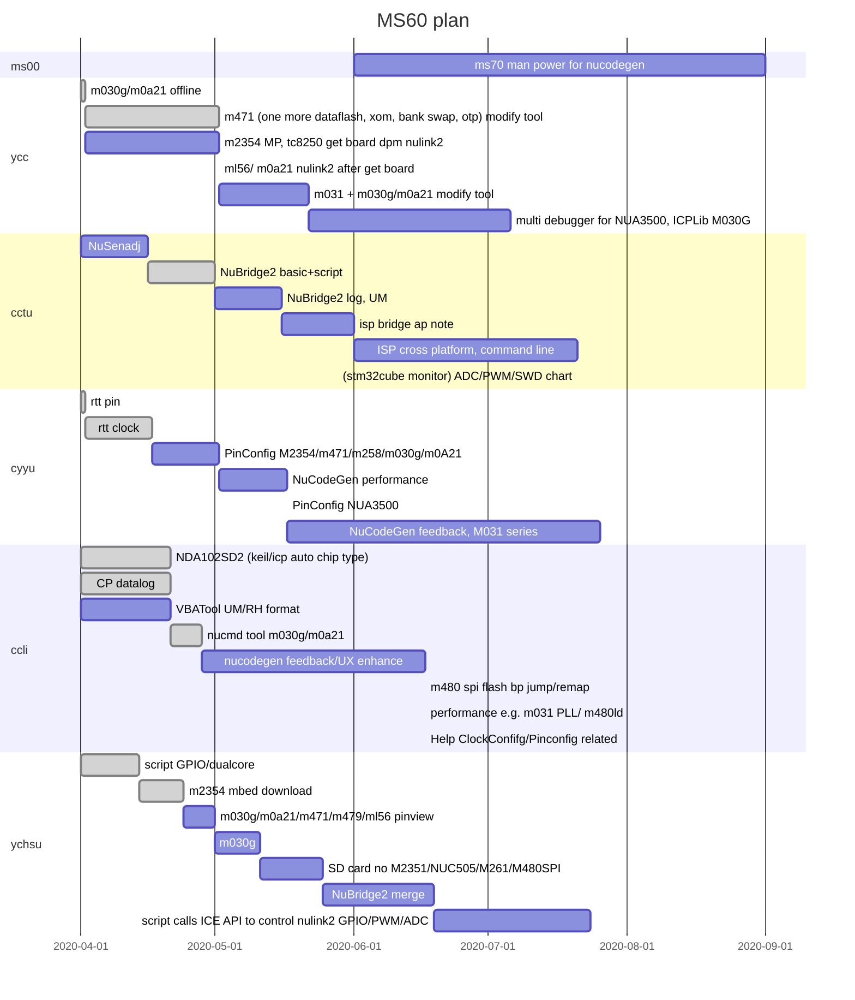

=====

    github opensource auto build and update
    version control git check trm            
    nucodegen auto test system, performance, coverage, add series            
    get customer mail/contact information

    8051 freeIDE
    offline cert export     
    swdlib: power control, general M0 support        
    cross platform ICP

    M487 TRNG for DH key
    cmsisDAPv2 + wcid  
    Estimate test USBH testing time for百佳泰 (if need)
    ETM some function name can't display on nutrace window
    ETM display line of the source code 
    ETM save log to a file
    ETM easy DWT config
    SWO, JTAG

    nucodegen todos
    NuEclipse dual bank/dpm/plm/xom   
    Nueclipse release nulink2 voltage better to be adjusted 
    clockConfig HXT 不能輸入小數 e.g. 22.1184MHz

    new isp protocol, IAP
    isp export/import

