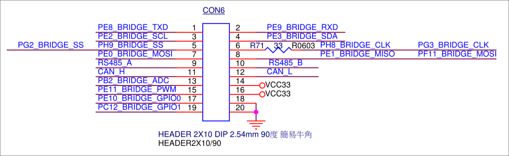
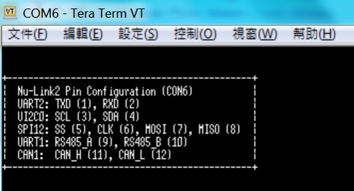
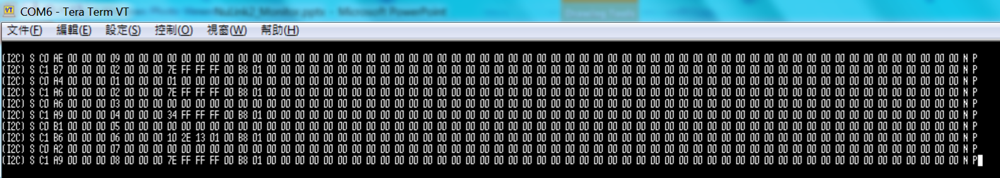

# Development Tool
[Nu-Link driver and NuTool](https://www.nuvoton.com/hq/support/tool-and-software/software/development-tool/)
# Programmer Tool
[ICPTool and ISPTool](https://www.nuvoton.com/hq/support/tool-and-software/software/programmer/)
# Nu-Link2 debugging and programming adapter
When using debugger and programmer tool above, you need an USB apatper. 
We introduce you a new feature-rich Nu-Link2 adapter here.
## The role of Nu-Link2 adapter

All Nu-Link2 firmware image .bin can be found [here](./Latest_NuLink_Firmware)

### NuLink2FW.bin
- Proprietary code (most of Nu-Link2 firmware are open source except NuLink2FW.bin)
- USB interfaces HID(proprietary commands)/MSC/VCOM 
- Support NuMicro 8051, NuMicro specific features (config0/config1 dataflash setting, KPROM, etc.), unlimited flash break points, offline programming, user code protection

### NuLink2_DAPLink.bin
- This is the latest image built from [DAPLink on Nu-Link2](https://github.com/OpenNuvoton/DapLink)
- USB interfaces HID(CMSIS-DAP)/MSC/VCOM 
- 3rd party IDE, customized ICE, mbed compatible

### NuLink2_ISP_Bridge_FW.bin
- This is the latest image built from [NuLink2_ISP_Bridge](https://github.com/OpenNuvoton/NuLink2_ISP_Bridge)
- ISP bridge firmware is also integrated into NuLink2FW.bin, so ISP tool can connect with NuLink2FW.bin, too.

### NuLink2_ISPLink2.bin
- This is the latest image built from [NuLink2_ISPLink2](https://github.com/OpenNuvoton/NuLink2_ISPLink2)
- Program ISPLink2 FW to Nu-Link2 -> pop up a USB DISK -> format it
Put DEFINE.TXT, TEST1.BIN into DISK
DEFINE.TXT
START
APROM=1
0:\\test1.bin
DATAFLASH=0
0:\\test2.bin
END

### NuLink2_Bus_Monitor.bin
#### pins
- I2C (PIN 3, 4)
- SPI (PIN 5~8 – SS, CLK, MOSI, MISO)
- RS485 (PIN 9, 10)
- CAN (PIN 11, 12)
- GND (PIN 18, 20)

configuration
SPI Bus 的傳輸只能是 Mode 0，Bit Length 8
RS485 Bus 的 Baud Rate 是 115200
CAN Bus 的 Baud Rate 是 500K

Data Only HEX (00-FF)
註：底層仍是 RS232

CAN 支援兩種格式的 ID
STD (11 bit ID HEX, 0~7FF)
EXT (29 bit ID HEX)
DLC 是 Data 長度
DATA, HEX (0000 - FFFF)

CAN/485/I2C/SPI Monitor tool FW (NuLink2 only)
Standalone: Bandwidth requirement

### NuLink2_ICP_Library.bin
- This is the latest image built from [ICP library](https://github.com/OpenNuvoton/NuLink2_ICP_Library)
- ICPLib (two-wire ICP interface for NuMicro cortexM & 8051)
Nu-Link1 (NUC12SRE3DN)
Nu-Link2 (M48SKIDAE)

## How to update Nu-Link2 firmware?
1. Press the button on Nu-Link2 and plug in USB cable.
2. A "Nu-Link2" disk will show. (If you see disk name is "NuMicro MCU", it will upgrade DUT firmware instead of Nu-Link2 itself) 
3. Drag and drop Nu-Link2 image .bin into the disk.
4. Re-plug the USB cable and it's done.

## On chip debugging
[pyOCD for Nu-Link2 (using CMSIS-DAP)](https://github.com/OpenNuvoton/pyOCD)

