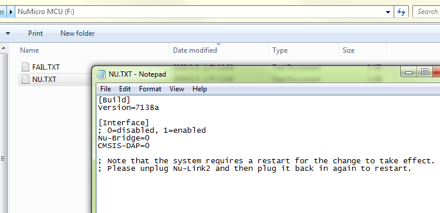
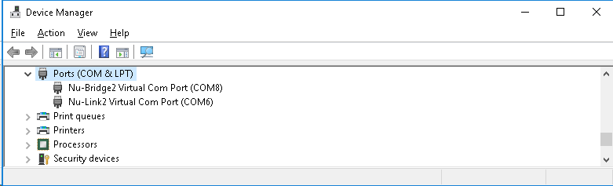
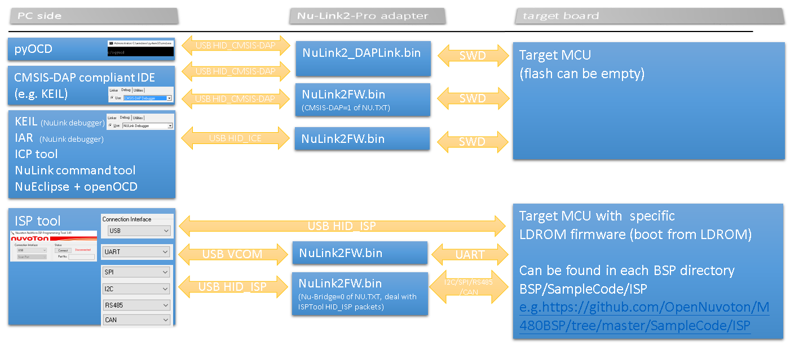
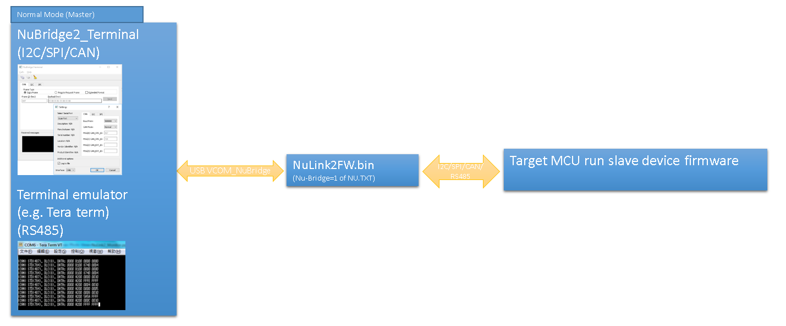
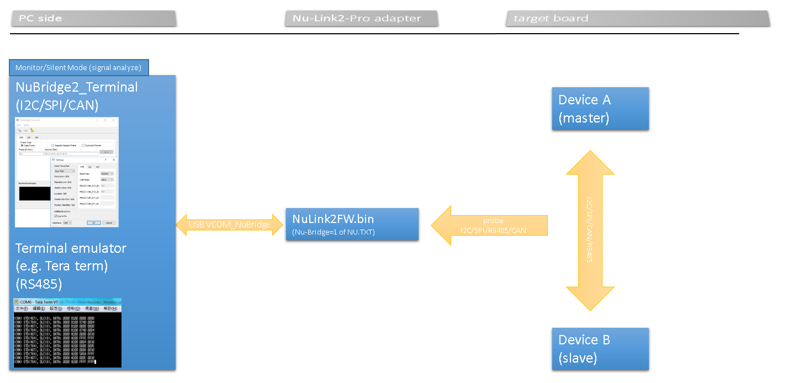

# NuMicro software development tools  
[Nuvoton tools official website](https://www.nuvoton.com/tool-and-software/software-development-tool/driver/)
## Development  
IDE and Debugger
- [KEIL Nu-Link debugger driver installer](https://www.nuvoton.com/resource-download.jsp?tp_GUID=SW1120200221180521)
- [IAR Nu-Link debugger driver installer](https://www.nuvoton.com/resource-download.jsp?tp_GUID=SW1120200221180914)
- [NuEclipse installer](https://www.nuvoton.com/resource-download.jsp?tp_GUID=SW1120200401182901)
- [PinView installer](https://www.nuvoton.com/resource-download.jsp?tp_GUID=SW1320200221181935)  
- [Customized pyOCD source code](https://github.com/OpenNuvoton/pyOCD) (using adapter firmware "NuLink2_DAPLink.bin")
- [Customized openOCD source code](https://github.com/OpenNuvoton/OpenOCD-Nuvoton)  (using adapter firmware "NuLink2FW.bin")
  
NuTool: Coding assistant  
- [PinConfig installer](https://www.nuvoton.com/resource-download.jsp?tp_GUID=SW1320200319135912)
- [ClockConfig installer](https://www.nuvoton.com/resource-download.jsp?tp_GUID=SW1320200930114649)

Signal pass-through/monitor (for I2C/SPI/CAN): 
- [NuBridge2_Terminal](https://www.nuvoton.com/) 

## Programmer  
- [ICPTool installer](https://www.nuvoton.com/resource-download.jsp?tp_GUID=SW1720200221181328)  
- [ISPTool installer](https://www.nuvoton.com/opencms/resource-download.jsp?tp_GUID=SW0320101221101703)  
- [ISPTool source code](https://github.com/OpenNuvoton/ISPTool)    
- [ISPTool command set](./doc/NuMicro_ISP_Flow_And_Command_Set.pdf)    
- [NuLink command tool installer](https://www.nuvoton.com/resource-download.jsp?tp_GUID=SW1720200221181644)  

 
 

# Nu-Link2-Pro debugging and programming adapter
When using debugging and programming tool above, you need an USB adapter. 
We introduce you a new feature-rich Nu-Link2-Pro adapter here.   
- [Where to buy](https://direct.nuvoton.com/tw/Nu-Link2-pro)   
- [User manual](https://www.nuvoton.com/resource-download.jsp?tp_GUID=UG1320200319174043)  
### The firmware of Nu-Link2-Pro adapter
All Nu-Link2-Pro firmware binary files can be found [here](./Latest_NuLink_Firmware)  
User can re-program Nu-Link2-Pro to another .bin file by the following instructions (Windows OS)  
1. Press the button on Nu-Link2-Pro and plug in USB cable.
2. A "Nu-Link2-Pro" disk will show.  (If you see disk name is "NuMicro MCU", it will upgrade DUT firmware instead of Nu-Link2-Pro itself) 
3. Drag and drop Nu-Link2-Pro firmware .bin file into the disk.
4. Re-plug the USB cable and it's done.
More options for NuLink2FW (configuration file NU.TXT)
1. When you upgrade the NuLink2FW.bin version larger than v7143, open NU.TXT file in pop-up "NuMicro MCU" disk, you will see some options in NU.TXT.  

2. For example, you can see Nu-Bridge and CMSIS-DAP option.
* Set Nu-Bridge=1 then re-plug in USB cable, Nu-Bridge function will be enabled. Nu-Bridge offers pass-through function for I2C/SPI/RS485/CAN interfaces.  
(You will see an "Nu-Bridge2 Virtual Com Port" in device manager.)  

* Set Nu-Bridge=0 then re-plug in USB cable, ISP-Bridge function will be enabled. ISP-Bridge offers I2C/SPI/RS485/CAN interfaces those communicate with ISPTool.  
(You will see an USB HID interface [VID:0x0416, PID:0x5203, interface:05] in device manager.)  
(Note that Nu-Bridge and ISP-Bridge will not present at the same time.)  
* Set CMSIS-DAP=1 then re-plug in USB cable, it presents one more interface HID_CMSIS-DAP, this is handy if you want to use CMSIS-DAP protocol.
(You will see an USB HID interface [VID:0x0416, PID:0x5203, interface:06] in device manager.)

### An overview picture of all NuMicro software development tools  

### Comparison of NuLink2FW and NuLink2_DAPLink  
#### [NuLink2FW.bin](./Latest_NuLink_Firmware)
- Proprietary code 
- Support NuMicro 8051, offline programming, user code read-out protection, unlimited flash break points, NuMicro chips specific features (config0/config1 dataflash setting, KPROM, etc.)
- USB interfaces: HID_ICE(proprietary commands)/MSC/VCOM/HID_CMSIS-DAP/HID_ISP or VCOM_NuBridge (set in NU.TXT)

#### [NuLink2_DAPLink.bin](./Latest_NuLink_Firmware)
- This is the latest image built from [DAPLink on Nu-Link2-Pro](https://github.com/OpenNuvoton/DapLink)  
- Support many 3rd party IDE
- USB interfaces: HID(CMSIS-DAP commands)/MSC/VCOM 

### Some other NuLink2 Example code
- [NuLink2_Offline_ISP](https://github.com/OpenNuvoton/NuLink2_ISPLink2)
- [NuLink2_ICP_Library](https://github.com/OpenNuvoton/NuLink2_ICP_Library)
            
 
 

